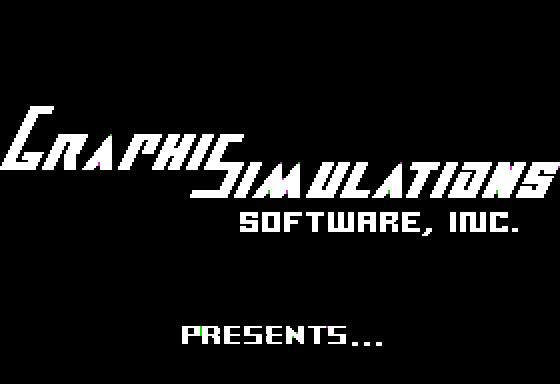

# Naja (Tactical Force Alliance) #

**Naja** is a futuristic fantasy role-playing game for the Apple ][, designed by Sean Callahan (me) (programming) and Richard Nielsen (artwork).

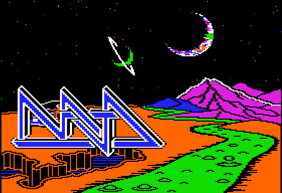

Copyright 1982-2025, Sean Callahan and Richard Nielsen

## History

We started Naja as 16-year-olds in the spring of 1982 and worked through our senior year of high school.  Development continued full-time from 1983 to 1985, with additional work being done part-time through 1989.

The game was originally designed for the Apple ][+ with 48K memory but was eventually upgraded to require an 80 column card or Apple //e with 64K.  It covered three floppy disks, six sides total, with its own custom copy protection system.

Naja's design was heavily influenced by the game Wizardry by Sir-Tech.  The use of line tunnels, hand-drawn maps on graph paper, and text-based fight narration are conventions that we adopted from Wizardry and, to a lesser degree, Ultima.  After many hours playing Wizardry, we thought we could do better and added features we considered innovative for the time.

* A futuristic sci-fi theme and new classes instead of a typical D&D/LotR theme.
* Full-screen, six-sided tunnels.
* Monster/alien graphics integrated into the tunnels instead of just overlaid.
* Use of animations and transition effects.
* A unique mapping scheme where each game level is wrapped on the outside of a cube to approximate a spherical space station.  Each cube level contained smaller cube levels, like a Russian nesting doll.

**Graphics Simulations Software** was incorporated in 1982 with the original intent of self-publishing Naja.  We eventually decided to publish through an established game company but didn't start actively looking for a publisher until 1988.  We demonstrated the game for publishers at the second-ever Computer Game Developer's Conference (Milpitas, California Holiday Inn, 1988), and then formally submitted it to Electronic Arts, Mediagenic/Activision, Epyx, New World Computing (Might and Magic), and Origin Systems (Ultima).  While we received positive responses to the game, most weren't interested in publishing because it was Apple ][-only and they had moved to simultaneous multi-platform releases.  The Apple ][ was considered a dying platform compared to the PC at that point.  Only Origin Systems showed any interest and started a contract conversation with us, but that later fell through.

A capture of the demo video tape submitted to publishers can be found at https://www.youtube.com/watch?v=HZTUacbMBF4&t=346s.

The title Naja comes from the game's villain which is also the genus name of cobra snakes.  It was later renamed to "Tactical Force Alliance" for clarity.

## Remaster/Continuation

After we failed to find a publisher for Naja, work stopped.  Decades later, I got the game building and running again, and stripped out the copy protection so it could work on standard floppies and under emulation.  That work, including the original source code, documents and other archives, can be found in https://github.com/seanahan5000/naja.

New development work continues in this repo.

Large parts of the code have been rewritten, replacing code I wrote when I was 16 with something based on a 40 year career in software development. For example, a new graphic compression algorithm has helped reduced the overall game size from six disk sides down to four.  (All graphics, however, remain true to the original game.)

Features like auto-mapping and an alien compendium have been added.  Gameplay is being worked on but has a long way to go.  Some special encounters (listed below) have been implemented and can be found throughout the game world.  However, all aliens fight with the same random, relatively weak stats.  No game balancing has been done.  Again, there's a long way to go.

Development is being done using VS Code and two custom extensions I've created -- An Apple II emulator/graphics editor and a 6502 syntax hiliter.

https://marketplace.visualstudio.com/items?itemName=seanahan5000.rpwa2
https://marketplace.visualstudio.com/items?itemName=seanahan5000.rpw65

## Running

The Naja disk images should run on any Apple II emulator, starting with the boot.nib image.

#### General Keys

- Move/turn left: J or `<left-arrow`>
- Move/turn right: K or `<right-arrow`>
- Move up/step forward: A or I or `<up-arrow`>
- Move down/turn around: Z or M or `<down-arrow`>
- Select: `<space`> or `<return`>
- Cancel/Back: C or `<escape`>

All UI will respond to the these keys, even if not explicitly stated with a "`<SPACE>`" or "C>ANCEL", for example.

NOTE: Only upper case input is supported so caps-lock must be enabled at all times for keys to work when running on a //e.  (Naja will run on an ][+, but the up and down arrows will not be available and some debug key combinations won't work.)

## Mothership

All preparation for exploration takes place here.

### Enrollment and Testing

Add create new characters and check for rank advancement here.
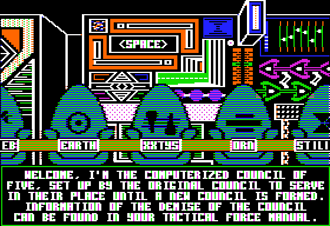

Apply adapatiation points to tailor a character to a specific profession.

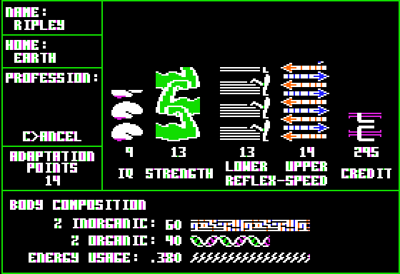

```
Minimum required statistics by profession:

            IQ  ST  LR  UR  CR  IN  OR
Warrior      6  21  19  20   0  20  45
Android     25  10  16  15   0  60  20
Cybernate   22  14  11  11   8  30  45
Juicer      14  18  17  17   0  45  30
Physician   23  10  14  19   0  15  60
```

TODO: turn CR values into actual numbers

### Group Assembly Office

Build your group from a roster of available characters.
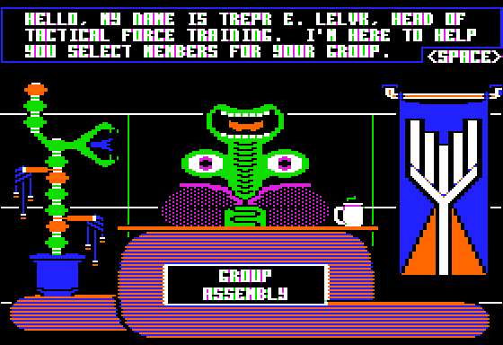

### Shuttle Loading

Send characters back to their home planet.

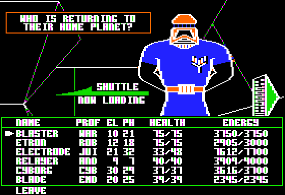

### Arsenal

Buy, sell, repair, and identify equipment here.
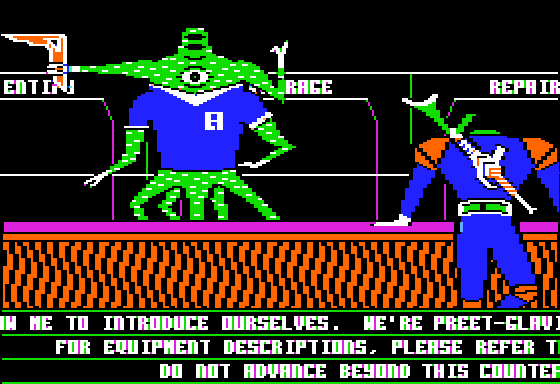

Design and purchase custom made armor, for example.

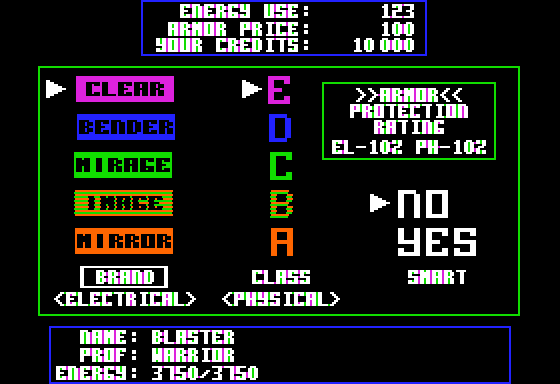

### Energy Distribution Center

Recharge your character's energy supply here.
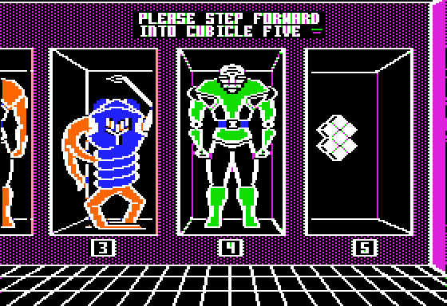

Surplus energy call also be sold back.
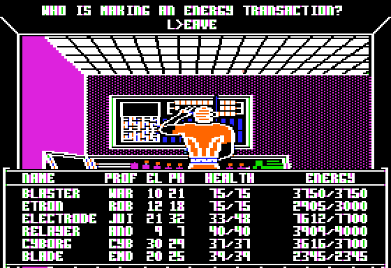

### Robot Ordering and Replacement Center
Your cybernate orders their robot here.

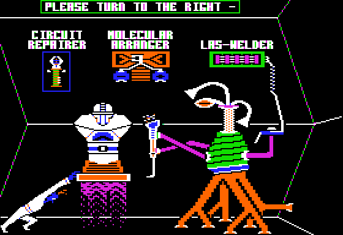

Parts of their robot can be upgraded as credits permit.

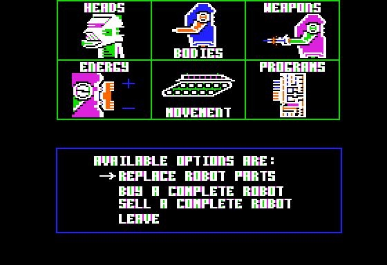

### Infirmary

Heal your characters wounds here.
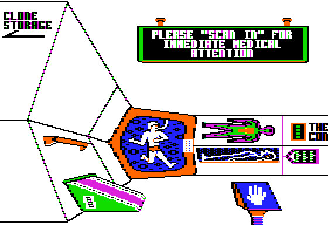

Various conditions can be treated.
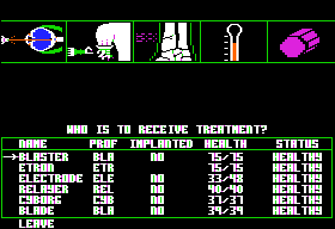

### Tesserport

Tesseract to the TRACC Station to begin your adventure.

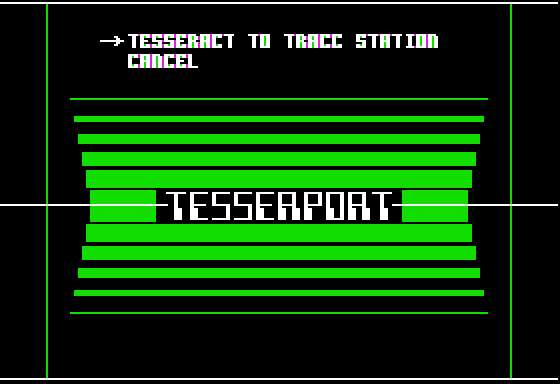

## TRACC Station

Where the actual adventuring takes place.

#### Miscellaneous Keys

- S: Stats, enter camp
- T: Tesseract back to Mothership (Only works on shell 1, any face)
- F: Show output of "face tracker", giving current shell and face information
- R: Change tunnel view range (hold Alt/Option to force maximum range, independent of android equipment)

#### Debugging Keys

- Left Alt/Option+T: Bring up alien editor, debug teleporter menu
- Left Alt/Option+<step>: Force alien encounter
- Left Alt/Option at end of encounter: Force dead group sequence
- Right Alt/Option+<step>: Force equipment find
- Left+Right Alt/Option+<step>: View all aliens
    - `<space`>: Next alien
    - `<escape`>: Leave alien viewer

#### Alien Editor

- `<left-arrow`>,`<right-arrow`>: Cycle through aliens
- `<space`>: Select value to edit
- `<escape`>: Back to previous screen
- Left Alt/Option+J: Jump to alien
- Left Alt/Option+S: Save
- Left Alt/Option+Q: Quit

#### Teleporter

* Space bar to change numbers
* All numbers are hex values

    NOTE: You may need to turn left/right/around and possibly take a step forward to see the actual special encounter after teleportation.

### Special Encounters

Below are most of the special encounters currently implemented in the TRACC station. Teleporter coordinates are in parenthesis.

#### Shell 1

* Viewport (S: 1, F: 3, X: 7, Y: 11) and (S: 1, F: 3, X: B, Y: 11)

    - "NO ONE CAN TRANSLATE THE WRITING.  DO YOU WANT TO TRY PRESSING BUTTONS?"
    - Press Y to see an animation of the viewport opening and a view of the title screen ship out in space.
    - All other doors along the hallway have viewports, but without buttons to open it.

* Airlock (S: 1, F: 3, X: 4, Y: 11) and (S: 1, F: 3, X: E, Y: 11)

    - Door display the infinity symbol and the letters A and L.
    - Stepping through the door was going to suck the entire group out the airlock and kill them.
    - This was never implemented.

* Door Sign (S: 1, F: 5, X: 1, Y: 9)

    - "DO YOU WANT `<android-character`> TO TRANSLATE THE WRITING?"
    - "THIS MARKS THE BORDER OF EMPEROR RUUIK'S ROYAL DOMAIN"

* King Ruuik (S: 1, F: 5, X: 8, Y: 9)

    - "I AM RUUIK, SUPREME EMPEROR OF THIS PLANET..."
    - Begin quest from "King" Ruuik to provide four light rifles in exchange for the password to the green nets and the codeword to avoid encounters with his soldiers.

* Elevator 123 (S: 1, F: 6, X: 4, Y: D)

    - Rotate to see the elevator screen on the wall and step towards it.
    - Press shell level '1', '2', or '3'.
    - Change drive to corresponding disk image (naja\bin\tracc1.nib, tracc2.nib, or tracc3.nib).
    - Press any key to see elevator animation.

* Green Orb Guard (S: 1, F: 6, X: 8, Y: F)

    - Automatic encounter with robot guarding green orb
    - (Currently only shows robot graphic, without need to fight it.)

* Green Orb Pedestal (S: 1, F: 6, X: 8, Y: 10)

    - Awards one of five orbs used to open the Orb Door on shell 5.

* Green Net (S: 1, F: 2, X: 2, Y: A) and various other locations

    - Rotate to see animation of net closing
    - Type password "GN-28" and return
    - Watch animation of net opening

#### Shell 2

* Elevator 123 (S: 2, F: 6, X: 2, Y: B)

    - See above.

#### Shell 3

* Elevator 123 (S: 3, F: 6, X: 1, Y: C)

    - See above.

* Elevator 345 (S: 3, F: 3, X: 4, Y: 7)

    - Rotate to see the elevator screen on the wall and step towards it.
    - Press shell level '3', '4', or '5'.
    - Change drive to corresponding disk image (naja\bin\tracc3.nib, tracc4.nib, or tracc5.nib).
    - Press any key to see elevator animation.

#### Shell 4

* Elevator 345 (S: 4, F: 3, X: 2, Y: 7)

    - See above.

#### Shell 5

* Elevator 345 (S: 5, F: 3, X: 1, Y: 4)

    - See above.

* Orb Door (S: 5, F: 6, X: 2, Y: 5)

    - Rotate to find face change opening and step through it.
    - "DO YOU WISH TO INSERT ORBS?"
    - Press 'Y' or 'N'
    - Watch orb door opening animation
